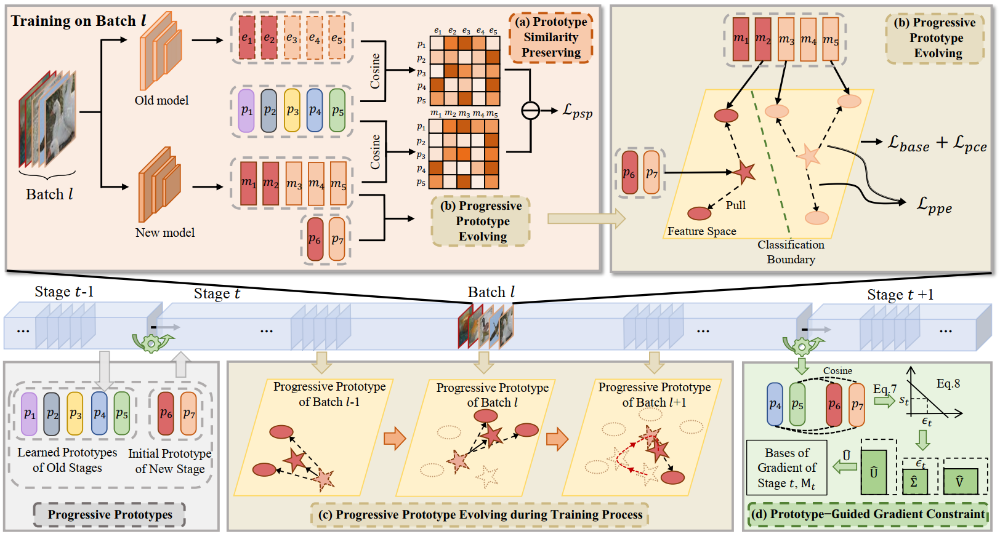

# Progressive Prototype Evolving for Dual-Forgetting Mitigation in Non-Exemplar Online Continual Learning

Official implementation of "[Progressive Prototype Evolving for Dual-Forgetting Mitigation in Non-Exemplar Online Continual Learning](https://openreview.net/forum?id=y5R8XVVA03)"


<p align="center"></p>


## Requirements

### Environment
Python 3.9.18

PyTorch 1.13.1+cu117

### Datasets
CIFAR-10 and CIFAR-100 will be automatically download.
Download the MiniImageNet Datasets from [this link](https://www.kaggle.com/whitemoon/miniimagenet/download).
## Run commands


```shell
# modify the --dataset_dir with your data path
bash r-cifar10.sh # Results on CIFAR-10
bash r-cifar100.sh # Results on CIFAR-100
bash r-mini.sh # Results on MiniImageNet
```

## Acknowledgement

This project is mainly based on [OnPro](https://github.com/weilllllls/OnPro), [GPM](https://github.com/sahagobinda/GPM), and [PCR](https://github.com/FelixHuiweiLin/PCR).

## Citation

If you find this work helpful, please cite:
```
@inproceedings{li2024progressive,
  title={Progressive Prototype Evolving for Dual-Forgetting Mitigation in Non-Exemplar Online Continual Learning},
  author={Li, Qiwei and Peng, Yuxin and Zhou, Jiahuan},
  booktitle={ACM Multimedia 2024}
}
```